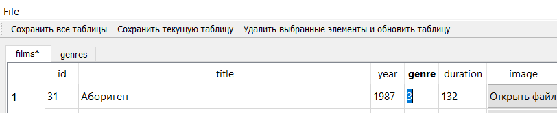
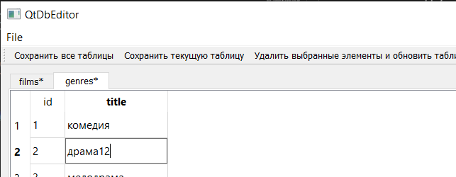
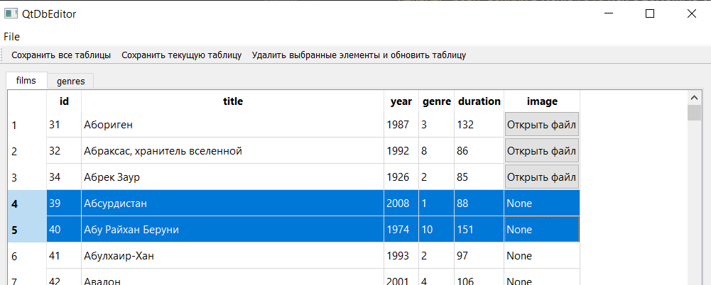
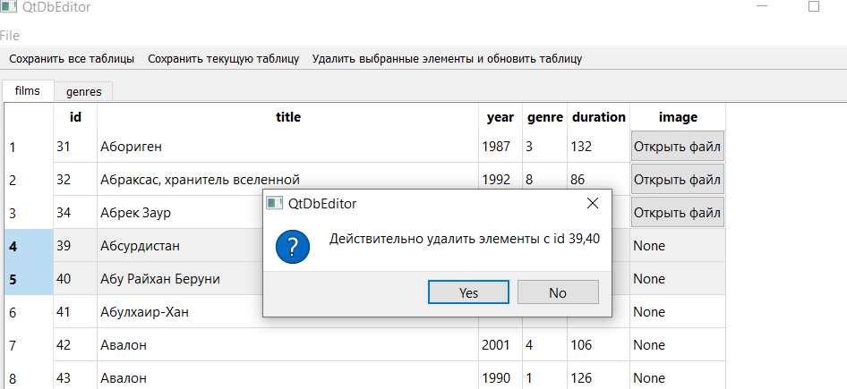
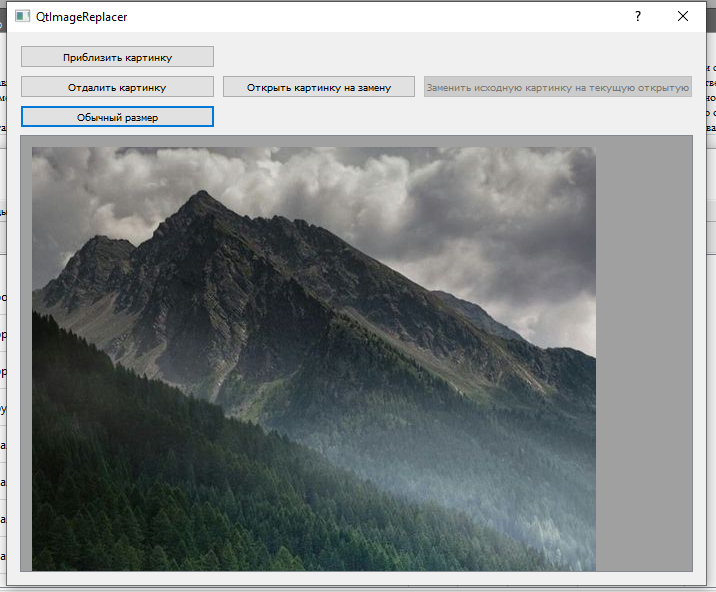
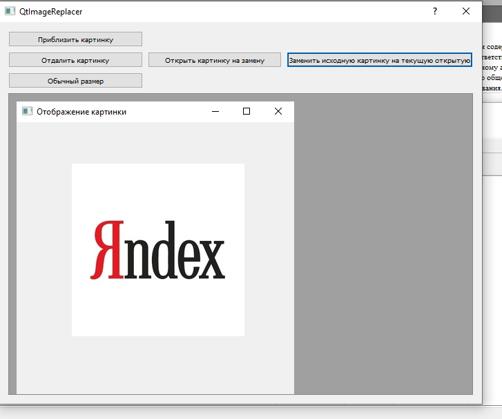

# Техническое задание
## Введение
Для реализации проекта на PyQt5 я выбрал проект просмотра, редактирования, удаления данных в базе данных sqlite, т.е. небольшую реализацию системы управления базами данных.
## Назначение
Программа QtDbEditor предназначена для просмотра, редактирования, удаления текстовой информации и замены картинок с расширением "jpg, jpeg" в sqlite базе данных.
## Цель
Реализовать программу с использованием PyQt для просмотра, редактирования, удаления текстовой информации и замены картинок с расширением "jpg, jpeg" в sqlite базе данных.
## Задачи
1. Реализовать главную форму пользовательского интерфейса для просмотра, редактирования, удаления текстовой информации в sqlite базе данных с использованием программы QtDesigner
2. Реализовать открытие, сохрание sqlite базы данных с использованием диалоговых окон pyqt5
3. Реализовать отображение данных таблиц базы данных в виджетах QTableWidget, разделение между таблицами реализовать с помощью QTabWidget
4. Реализовать редактирование текстовой информации в одной таблице и сохранение изменений в открытой базе данных
5. Реализовать редактирование текстовой информации в нескольких таблицах данных и сохранение изменений в нескольких таблицах данных одновременно в открытой базе данных
6. Реализовать удаление строк базы данных при помощи выделения данных строк в виджете QTableWidget
7. Реализовать форму замены картинок с расширением "jpg, jpeg" с использованием программы QtDesigner
8. Реализовать просмотр, замену картинки в базе данных при помощи формы замены картинок
## Требования к проекту
1. Проект должен быть реализован с помощью PyQt
2. Проект должен позволять открывать sqlite базу данных
3. Проект должен позволять сохранять sqlite базу данных с определенным пользователем именем базы данных
4. Проект должен позволять просматривать текстовые данные и картинки с расширениями jpg, jpeg при помощи виджета QTableWidget с отображением полей таблиц открытой базы данных
5. Проект должен позволять редактировать текстовые данные таблиц открытой базы данных
6. Проект должен позволять заменять картинки в таблицах другой картинкой с расширениями jpg, jpeg открытой базы данных
7. Проект должен позволять просматривать картинки с расширениями jpg, jpeg на замену в форме замены картинки
8. Проект должен позволять удалять строки базы данных при помощи выделения данных строк в виджете QTableWidget
9. Проект должен позволять редактировать текстовую информацию в нескольких таблицах данных и сохранение изменений в нескольких таблицах данных одновременно в открытой базе данных
10. Проект должен реализовывать разделение между таблицами базы данных при помощи виджета QTabWidget
## Используемые технологии
1. Библиотека PyQt5
2. PyQtDesigner
3. Библиотека Magic для определения расширения файла

# Запуск проекта
## Запуск без использования исходников
Для запуска на Windows запустите файл ```QtDbEditor.exe``` из папки dist в корне проекта
## Запуск с использованием исходников
### Установка всех необходимых зависимостей
Пропишите в терминале в PyCharm или в любой консоли в корне проекта ```pip install -r requirements.txt```
### Запуск
Для запуска проекта запустите файл ```main.py```

# Инструкция по использованию
Для использования приложения вам необходимо запустить проект по инструкции выше, далее вы можете использовать приложение в соответсвии с приведенными ниже сценариями использования.
## Сценарии использования
### 1. Изменение текстовых данных в 1 таблице базы данных
1. Откройте базу данных при помощи окна выбора базы данных при помощи действия ```Открыть базу данных``` в меню ```File``` или с помощью сочетания клавиш CTRL + O.
2. Измените элемент, кроме элементов колонки ```id```,  в открытой таблице в определеной вкладке при помощи нажатии на элемент и ввода в это поле другого значения соответствуещего типу данной колонки.

3. Для сохранения изменений нажмите на кнопку ```Сохранить текущую таблицу```, не меняя вкладку выбора таблицы.

### 2. Изменение текстовых данных в нескольких таблицах базы данных
1. Откройте базу данных при помощи окна выбора базы данных при помощи действия ```Открыть базу данных``` в меню ```File``` или с помощью сочетания клавиш CTRL + O.
2. Измените элементы, кроме элементов колонки ```id```,  в открытых таблицах в нескольких вкладках при помощи нажатии на элемент и ввода в это поле другого значения соответствуещего типу данной колонки.

3. Для сохранения изменений нажмите на кнопку  ```Сохранить все таблицы```

### 3. Удаление строк определенной таблицы базы данных
1. Откройте базу данных при помощи окна выбора базы данных при помощи действия ```Открыть базу данных``` в меню ```File``` или с помощью сочетания клавиш CTRL + O.
2. Выделите одну или несколько строк таблицы базы данных

3. Для удаления нажмите на кнопку ```Удалить выбранные элементы и обновить таблицу``` и в отрытом диалоговом окно нажмите ```Yes```


### 4. Замена картинки
1. Откройте базу данных при помощи окна выбора базы данных при помощи действия ```Открыть базу данных``` в меню ```File``` или с помощью сочетания клавиш CTRL + O.
2. Нажмите на кнопку ```Открыть файл``` у элемента, у которого есть файл картинки с расширением jpg, jpeg
3. Вы можете отдалить или приблизить картинку для просмотра, далее выберите картинку на замену, для этого нажмите на кнопку ```Открыть картинку на замену```

4. Вы можете отдалить или приблизить картинку для просмотра картинки на замену, для замены нажмите на кнопку ```Заменить исходную картинку на текущую открытую``` 


### 5. Сохранение базы данных под другим именем
1. Откройте базу данных при помощи окна выбора базы данных при помощи действия ```Открыть базу данных``` в меню ```File``` или с помощью сочетания клавиш CTRL + O.
2. Сохраните базу данных при помощи окна сохранения базы данных при помощи действия ```Сохранить базу данных как``` в меню ```File```.
